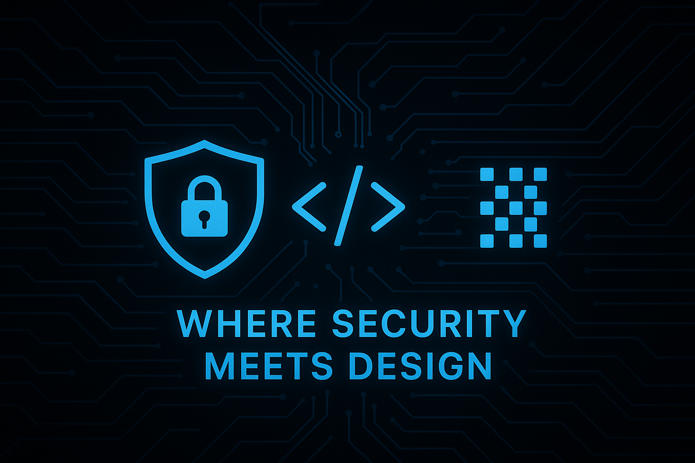

🔐 **Cybersecurity Professional** | 💻 **Web Developer** | 🤖 **AI Enthusiast**

* Mom | Student | Curious Mind | Lifelong Learner |

  With a background in **Cybersecurity Engineering** and a passion for **modern web development**,  
I focus on creating secure, intelligent, and user-friendly digital experiences.

🌿 I love blending creativity with logic — whether it’s designing interfaces or protecting data.

## 💡 About Me

🎓 Currently a student passionate about mobile web development using AI.  
💻 Developer focused on building elegant and efficient solutions.  
✨ Lover of clean code, creative design, and open-source collaboration.  
📱 Exploring the intersection of **mobile design** and **artificial intelligence**.

## 🛠️ Skills & Interests

- **Languages**: JavaScript, HTML, CSS, Python  
- **Frameworks/Tools**: Git, VS Code, Adobe XD, photoshop,Ai
- **Passions**: Mobile Web Apps, AI-powered tools, UI/UX design  
- **Exploring**: Prompt engineering, creative coding, and cybersecurity basics

- ### 🧰 Tech Stack

  

### ✨ Motto
> *“Design securely. Code intelligently. Build with purpose.”*

## 🚀 Projects

- [EduBot](https://github.com/Senacode/July4_Assignment_3) — AI tutor that helps students learn smarter  

## 🌍 Let's Connect

- 📧 Email: Wubit.e@triosstudent.com
- 🐙 [GitHub](https://github.com/Senacode)

© 2025 Wubitcode. All rights reserved.
